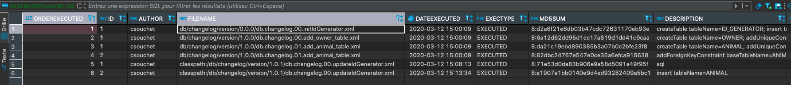

# Poc with Liquibase

 
 
## databaseChangeLog
- http://www.liquibase.org/documentation/databasechangelog.html
- http://www.liquibase.org/documentation/xml_format.html
- http://www.liquibase.org/bestpractices

### includeAll

Liquibase va rechercher dans le dossier tous les changeLogs à exécuter puis les exécuter un à un. 
Toutefois, cette méthode est à utiliser avec beaucoup de prudence car Liquibase va exécuter les fichiers changeLogs par ordre alphabétique. 
Au sein de l’équipe, il convient donc de définir au préalable une convention de nommage des fichiers changeLogs afin d’éviter d’avoir des fichiers chargé dans un ordre erratique…

### include
Need to specify all files one by one.

### logicalFilePath
Use to override the file name and path when creating the unique identifier of change sets. 
Required when moving or renaming change logs, or moving change set to another file.

## ChangeSet
http://www.liquibase.org/documentation/changes/index.html

### preConditions
Preconditions can be attached to change logs or changesets to control the execution of an update based on the state of the database.

If desired, a precondition can be the only tag in a <changeSet>.

Preconditions at the changelog level apply to all changeSets, not just those listed in the current changelog or its child changelogs.
If any of the preconditions fail, the Liquibase will exit with an error message explaining what failed. 

### insert
Inserts data into an existing table
https://www.liquibase.org/documentation/changes/insert.html

## Sources
- https://blog.soat.fr/2015/10/liquibase-et-le-versioning-de-base-de-donnees/
- https://www.baeldung.com/liquibase-refactor-schema-of-java-app
- https://docs.spring.io/spring-boot/docs/current/reference/html/appendix-application-properties.html#data-migration-properties
- http://www.liquibase.org
- https://www.liquibase.org/documentation/column.html